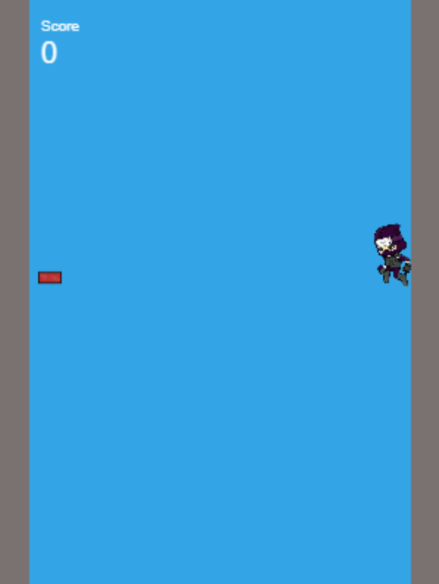

# Ninjump - [One Minute jump #9](https://itch.io/jam/one-minute-game-jam-9) Submission

Play it on itch.io now: https://colinkiama.itch.io/ninjump

This is built from @goecine's [Phaser 3 Rollup TypeScript template](https://github.com/geocine/phaser3-rollup-typescript)

## Description

Jump across wall to wall to stay up, while avoiding bricks along the way.

However, don't try to jump to quickly or you'll slip!

Avoid as many bricks as you can. Good luck!

## Controls

| Input                                          | Action |
| ---------------------------------------------- | ------ |
| `Space`/ `Primary Mouse Click` /`Touch Screen` | Jump   |

## Development

### Available Commands

| Command        | Description                                              |
| -------------- | -------------------------------------------------------- |
| `yarn install` | Install project dependencies                             |
| `yarn dev`     | Builds project and open web server, watching for changes |
| `yarn build`   | Builds code bundle with production settings              |
| `yarn serve`   | Run a web server to serve built code bundle              |

After cloning the repo, run `yarn install` from your project directory. Then, you can start the local development
server by running `yarn dev` and navigate to http://localhost:3000.

### Production

After running `yarn build`, the files you need for production will be on the `dist` folder. To test code on your `dist` folder, run `yarn serve` and navigate to http://localhost:5000
